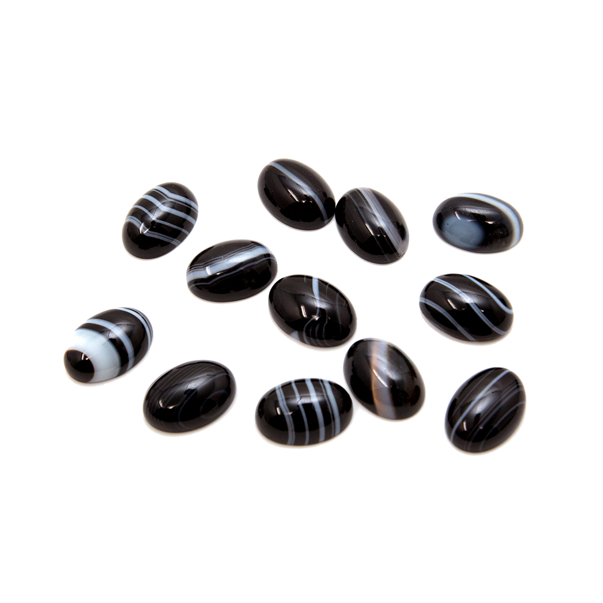

# Welcome to Onyx Ultrasonics Ltd

  

Onyx Ultrasonics is an engineering company consulting in transducer engineering, sonar and ultrasonics.

## Our Expertise

At Onyx Ultrasonics, we specialise in innovative solutions for transducer design and production. Drawing on our expertise in materials and measurement, we tailor transducers for diverse applications.

-   :material-waves:{ .lg .middle } **Transducer Engineering**

    ---

    Custom transducer design and development for specialised applications

    [:octicons-arrow-right-24: Learn more](services/transducers.md)

-   :material-radar:{ .lg .middle } **Sonar Solutions**

    ---

    Advanced sonar systems for maritime and underwater applications

    [:octicons-arrow-right-24: Explore sonar](services/sonar.md)

-   :material-sine-wave:{ .lg .middle } **Ultrasonics**

    ---

    Ultrasonic technology for industrial and scientific applications

    [:octicons-arrow-right-24: Discover ultrasonics](services/ultrasonics.md)

## Key Applications

Our solutions serve multiple industries with cutting-edge technology:

- **Maritime** - Underwater communication and navigation systems
- **Non-Destructive Testing** - Quality assurance and material inspection
- **Flow Measurement** - Precise flow monitoring and control systems

[Explore our applications](applications/index.md){ .md-button .md-button--primary }

## Why Choose Onyx Ultrasonics?

!!! success "Expertise & Innovation"
    We combine deep technical knowledge with innovative approaches to solve complex engineering challenges.

!!! info "Custom Solutions"
    Every project is unique. We design and deliver tailored solutions that meet your specific requirements.

!!! tip "Quality Assurance"
    Our rigorous testing and validation processes ensure the highest quality standards.

## Get Started

Ready to discuss your project? We're here to help with your transducer, sonar, and ultrasonic needs.

[Contact Us](contact.md){ .md-button }
[Learn About Our Services](services/index.md){ .md-button }

---

*Building the future of ultrasonic technology, one transducer at a time.*
